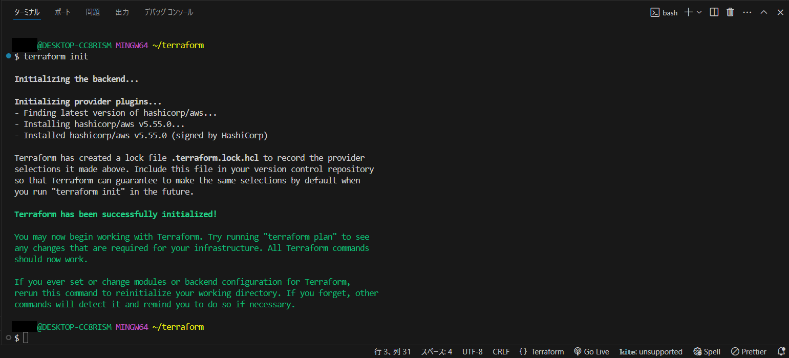
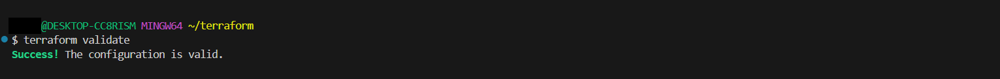

# terraformコマンドのメモ書き
### 設定ファイルの初期化
```sh
$ terraform init
```

### コードの整形
```sh
$ terraform fmt
```
### 構文のチェック
```sh
$ terraform validate
```
問題がない場合  

### ドライラン
```sh
$ terraform plan
```
### 実効
```sh
$ terraform apply
```
### リソースの削除
```sh
$ terraform destroy
```
